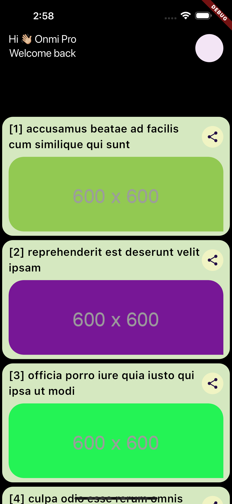
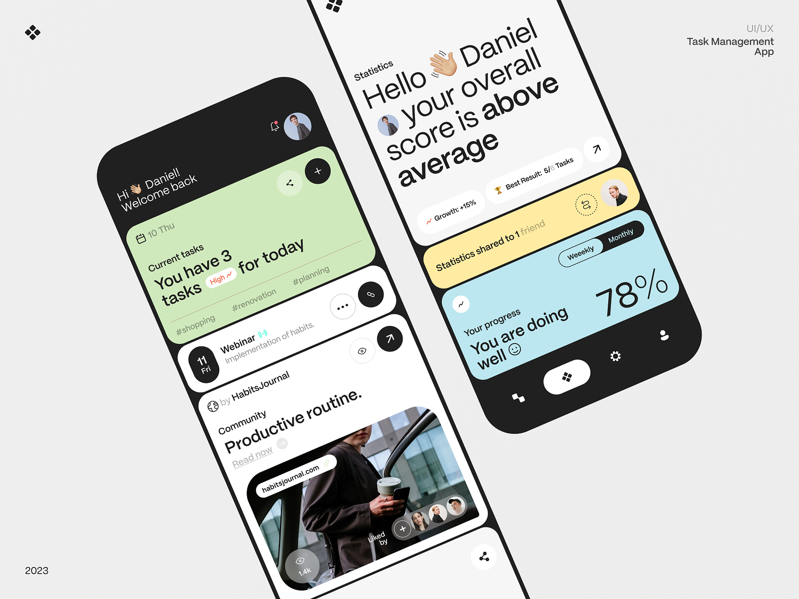

# OmniPro - Flutter Photo

Esta prueba evaluará su capacidad para escribir código limpio, eficiente y fácil de mantener
utilizando el framework Flutter

- La aplicación debe usar el paquete http para recuperar datos de la API.
- La aplicación debe usar el widget ListView para mostrar la lista de elementos.
- La aplicación debería manejar los errores correctamente y mostrar un mensaje de error si hay un problema con alguna API.
- La aplicación debe implementar la paginación para recuperar datos en lotes de 10 elementos por página.

## Requisitos previos

Asegúrate de tener las siguientes herramientas instaladas:

- [Flutter](https://flutter.dev/docs/get-started/install) (versión 3.22.0 o superior)
- [Dart](https://dart.dev/get-dart)
- [Android Studio](https://developer.android.com/studio) o [Visual Studio Code](https://code.visualstudio.com/) con las extensiones de Flutter y Dart
- Emulador o dispositivo físico para pruebas


## Instalación

:warning: Considerar utilizar la version 3.22.0 de flutter o superior. :warning:

1. Clonar el repositorio:

   ```sh
   git clone https://github.com/luisfevq/flutter_photo.git

2. Navegar al directorio del proyecto:

   ```sh
   cd flutter_photo

3. Instalar las dependencias:

   ```sh
   flutter pub get

4. Ejecutar la aplicación:

   ```sh
   flutter run
   ```

:tada: Listo a disfrutar! 

## Screenshot (capturas)




## Descripción de la Arquitectura

### core/
Contiene las clases esenciales y utilidades como excepciones, manejo de errores y códigos de estado que son utilizados en todo el proyecto.

### data/
Maneja la obtención de datos, ya sea desde una API, base de datos local, o cualquier otra fuente de datos.

- **api/**: Contiene las clases que interactúan directamente con las APIs externas.
- **datasource/**: Define las fuentes de datos, ya sea remoto o local.
- **model/**: Define los modelos de datos utilizados en la capa de datos.
- **repository/**: Implementaciones concretas de los repositorios que definen cómo se obtienen y manejan los datos.

### domain/
Contiene las entidades de dominio y casos de uso. Esta capa es independiente de cualquier framework específico y define las reglas de negocio.

- **entities/**: Define las entidades de dominio.
- **repository/**: Define las interfaces de los repositorios.
- **usecase/**: Contiene los casos de uso que encapsulan la lógica de negocio.

### presentation/
Maneja todo lo relacionado con la interfaz de usuario, incluyendo la lógica de presentación (Bloc, eventos, estados) y los widgets de la UI.

- **home/**: Contiene todo lo relacionado con la pantalla principal.
  - **bloc/**: Contiene el Bloc, eventos y estados para manejar la lógica de la pantalla principal.
  - **home_page.dart**: La página principal de la aplicación.
- **widgets/**: Contiene widgets reutilizables en la aplicación.

### main_module.dart
Define el módulo principal de la aplicación y la configuración inicial.

### main.dart
Punto de entrada de la aplicación.

```sh
lib/
│
├── core/
│ ├── exceptions.dart
│ ├── failure.dart
│ └── status_code.dart
│
├── data/
│ ├── api/
│ │ └── photo_api.dart
│ │
│ ├── datasource/
│ │ └── photo_datasource.dart
│ │
│ ├── model/
│ │ └── photo_model.dart
│ │
│ └── repository/
│ └── photo_repository_imp.dart
│
├── domain/
│ ├── entities/
│ │ └── photo_entity.dart
│ │
│ ├── repository/
│ │ └── photo_repository.dart
│ │
│ └── usecase/
│ └── get_photo_usecase.dart
│
├── presentation/
│ ├── home/
│ │ ├── bloc/
│ │ │ ├── home_bloc.dart
│ │ │ ├── home_event.dart
│ │ │ └── home_state.dart
│ │ │
│ │ └── home_page.dart
│ │
│ └── widgets/
│ ├── dialog.dart
│ └── item_list_widget.dart
│
├── main_module.dart
└── main.dart
 ```

## Principios SOLID:
- (S)ingle Responsibility: Datasource, model, entities, usecase.
- (O)pen/Closed: Usecase.
- (L)iskov Substitution: Implícito en el uso de interfaces y abstracciones.
- (I)nterface Segregation: Api.
- (D)ependency Inversion: Repository (data y domain).


## Inspiracion del diseño :speak_no_evil:


